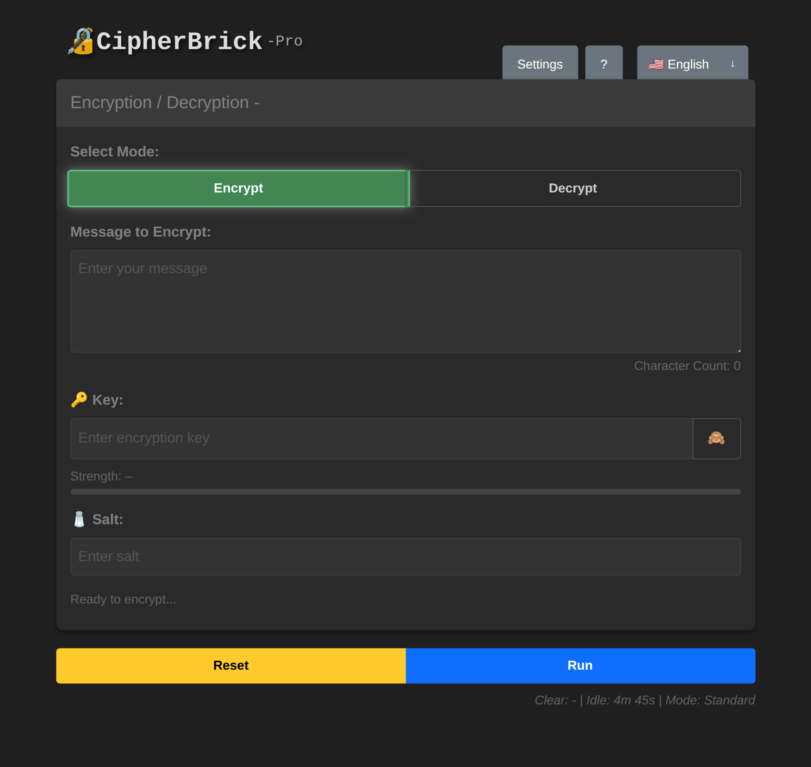
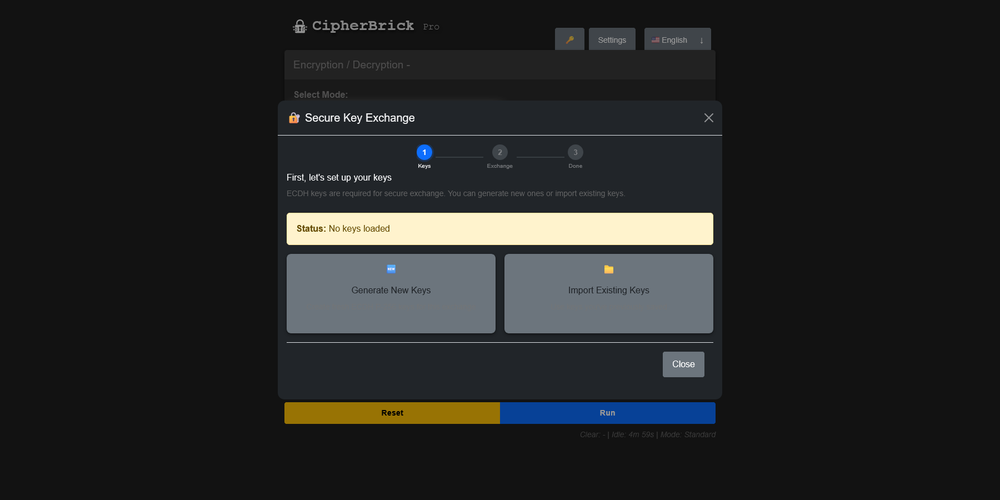
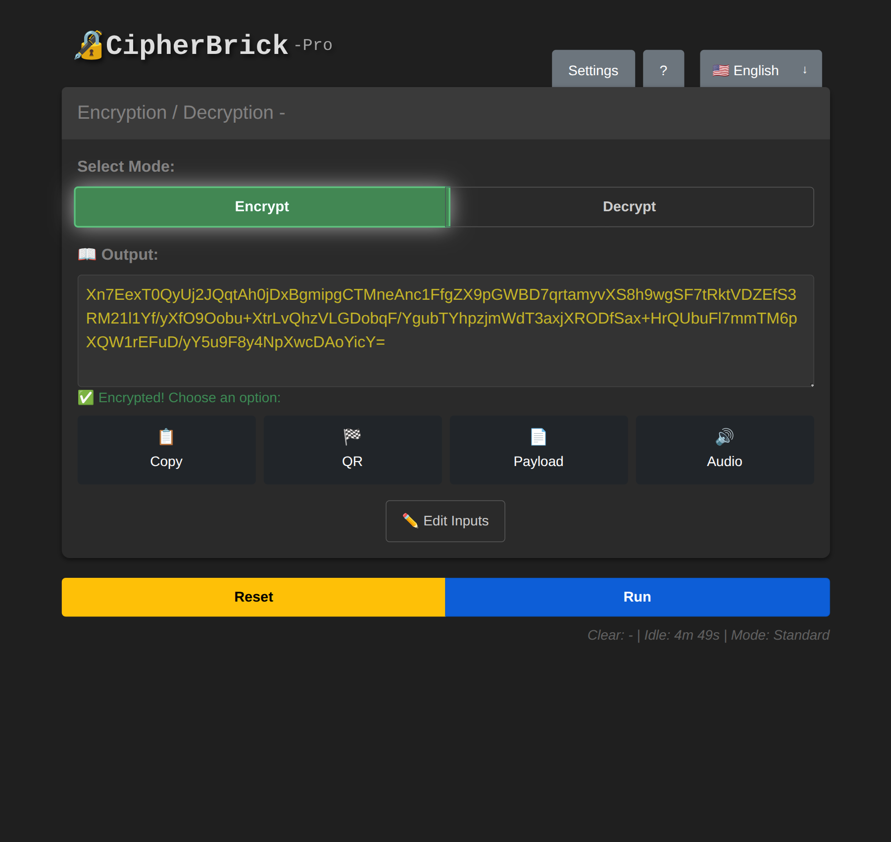

# CipherBrick Pro

**Offline AES-256-GCM message encryption. No accounts. No servers. No cloud.**

CipherBrick Pro is an open source, privacy-focused encryption tool that runs entirely in your browser. Encrypt and decrypt messages using industry-standard AES-256-GCM encryption; all processing happens on your device. Nothing is transmitted, stored on a server, or linked to an account.

Try it: [app.cipherbrick.com](https://app.cipherbrick.com) | [cipherbrick.com](https://cipherbrick.com)



## Philosophy

CipherBrick Pro does not implement its own encryption. All cryptographic operations use browser-native primitives via the **Web Crypto API**, the same APIs used by browsers themselves, built and maintained by browser vendors, and independently audited.

The goal is not to hide encryption from the user, but to make it accessible. Every operation (key generation, encryption, decryption, key exchange) is transparent and explainable. Users see the keys, the output, and the process. The app streamlines the workflow without abstracting away the fundamentals.

Nothing is sent to a server. There are no key databases, no stored credentials, no remote persistence. Sensitive values are held in browser memory for the active session and cleared on idle timeout or tab close. Two features use browser sessionStorage as a short-lived local buffer: the Key Exchange Wizard stores key pair material for up to one hour to support asynchronous exchanges; audio mode preserves form state during the page refresh that protocol switching requires. Both are cleared automatically by the app's session logic and remain entirely on your device. The intentional persistence exception is the Key Exchange Wizard's export function, which allows saving a key pair as a JSON file so two parties can complete an exchange on their own schedules without requiring simultaneous communication.

To back this up, CipherBrick Pro includes automatic timers with sensible defaults: clipboard contents are cleared after 30 seconds and the form resets after 5 minutes of inactivity. Both are configurable in Settings. These defaults ensure that sensitive data is not left exposed if a user forgets to manually clear the page.

---

## Features

- **AES-256-GCM encryption** with user-supplied or randomly generated keys
- **Fully offline:** works without an internet connection after the first load
- **Key Exchange Wizard:** securely establish a shared key with another person using ECDH; the sender's public key is embedded in the exchange string automatically, with no separate sharing step required


- **Audio transmission:** the encrypted string produced after encrypting a message is converted to audio tones using the [ggwave](https://github.com/ggerganov/ggwave) data-over-sound protocol and received by another device; useful for air-gapped scenarios with no network or camera access
- **Hardware key support (HKPM):** bind encryption to a FIDO2 security key (e.g. YubiKey) using the WebAuthn PRF extension for hardware-level protection
- **Simple mode:** hides the salt field and randomly generates a salt that is embedded directly in the encrypted output string; the recipient does not need to know or manually enter the salt, reducing friction for less technical users while keeping the full security of AES-256-GCM intact
- **Session timer:** automatically clears keys and sensitive data after inactivity
- **9 languages:** English, Spanish, French, German, Italian, Portuguese, Russian, Japanese, and Chinese (Simplified); chosen to cover the most widely spoken languages in the world. All aspects of the app are fully translated including the help documentation and error messages.
- **QR code sharing:** encrypted output can be shared as a QR code for easy scanning between devices
- **No accounts, no telemetry, no ads, no cloud sync**

---

## How It Works

1. Both parties agree on a shared encryption key (or use the Key Exchange Wizard to establish one securely)
2. The sender types a message (up to 500 characters), enters the key, and encrypts
3. The encrypted output is sent through any channel: email, SMS, chat, etc.
4. The recipient pastes the encrypted string, enters the matching key, and decrypts

The encrypted output is a self-contained string that can be safely transmitted over any medium.



---

## Security Model

- **Algorithm:** AES-256-GCM with a random 12-byte IV per encryption operation
- **Key derivation:** PBKDF2-SHA256, 100,000 iterations — a deliberate choice. In Standard mode, the salt is user-supplied and shared out-of-band alongside the key. In Simple mode, a random 16-byte salt is generated per encryption and embedded directly in the payload so the recipient does not need to know or enter it separately. Iteration count slows offline guessing attacks but cannot rescue a guessable key; a high-entropy key is infeasible to brute-force regardless of iteration count. Security in passphrase modes rests on key strength, which the app enforces through a pattern-aware strength meter and an explicit confirmation step before encrypting with a weak key. A future format revision may raise this value with backward compatibility preserved through payload versioning.
- **No server:** all cryptographic operations run in the browser via the Web Crypto API
- **No remote persistence:** keys and plaintext are never sent to a server; sensitive values clear on idle timeout or tab close (see Philosophy section for sessionStorage details)
- **No network requests:** after the service worker caches the app shell on first load, the app makes zero network requests during normal operation
- **Open source:** all cryptographic logic is auditable in [`js/modules/crypto.js`](js/modules/crypto.js)
- **Browser compatibility:** Standard and Key Exchange modes work in all modern browsers. HKPM requires Chrome or Edge; Firefox does not support the WebAuthn PRF extension with hardware keys.

### Hardware Key Mode (HKPM)

HKPM uses the WebAuthn PRF extension to gate release of deterministic key material from a FIDO2 authenticator. The browser then derives a non-exportable P-256 ECDH session key from that material via Web Crypto. The session key cannot be extracted from the browser and is cleared when the session ends. All cryptographic operations use browser-native primitives via the Web Crypto API with no third-party crypto libraries involved.

HKPM supports both **hardware security keys** (e.g. YubiKey 5 series) and **passkeys** stored on a device or platform authenticator. Chrome is the recommended and fully tested browser.

- Requires a PRF-capable FIDO2 authenticator
- Requires Chrome or Edge (Firefox does not support PRF with hardware keys)
- Compatible with the Android TWA build when using Chrome

---

## Deployment Options

| Option | URL | Notes |
|--------|-----|-------|
| Hosted PWA | [app.cipherbrick.com](https://app.cipherbrick.com) | Always up to date |
| Android app | [Google Play](https://play.google.com/store/apps/details?id=com.cipherbrick.pro) | TWA wrapping the hosted PWA |
| iOS | Safari at [app.cipherbrick.com](https://app.cipherbrick.com) | Add to Home Screen for PWA install |
| Self-hosted | Clone this repo | Any static web server |

Encrypted output is fully interoperable across all deployment methods for Standard and Key Exchange modes. A message encrypted on Android can be decrypted in a desktop browser or a self-hosted instance without any changes. HKPM is the exception; see [HKPM and Domain Binding](#hkpm-and-domain-binding) below.

---

## Self-Hosting

CipherBrick Pro is a static web app with no build step required.

```bash
git clone https://github.com/Cliff3c/Cipherbrick-Pro.git
cd Cipherbrick-Pro
# Serve with any static file server, for example:
npx serve .
```

For production use, serve over HTTPS. The Web Crypto API and WebAuthn both require a secure context.

### HKPM and Domain Binding

Hardware Key Private Message mode (HKPM) uses the WebAuthn PRF extension to derive a deterministic ECDH key pair from a FIDO2 credential. WebAuthn credentials are bound to the domain (rpId) at registration time, meaning the same hardware key will produce **different encryption keys on different domains**.

This means:
- HKPM credentials registered on `app.cipherbrick.com` are not portable to a self-hosted instance at a different domain
- Self-hosters who use HKPM must register a new credential on their own domain
- Encrypted messages produced using HKPM on one domain cannot be decrypted using HKPM on a different domain, even with the same hardware key

If interoperability with the hosted instance (`app.cipherbrick.com`) is required, use Standard or Key Exchange mode instead, as those are domain-agnostic.

---

## Contributing

Issues and pull requests are welcome. If you find a bug or have a feature suggestion, please [open an issue](https://github.com/Cliff3c/Cipherbrick-Pro/issues).

---

## License

MIT. See [LICENSE](LICENSE) for details.
